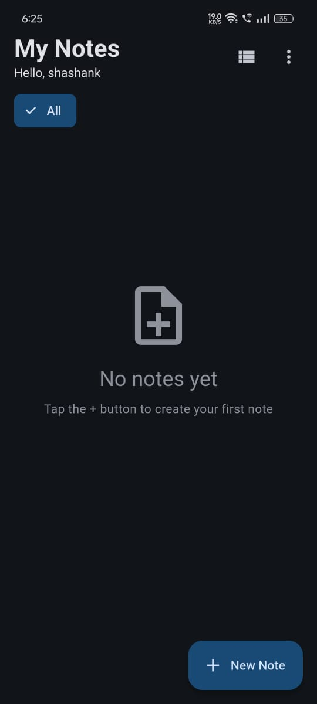
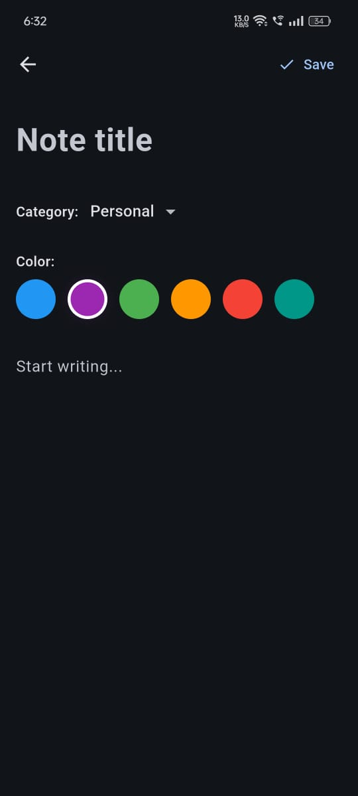

# NotionNotes 📝

> A beautiful, minimalist notes application built with Flutter and Node.js. Organize your thoughts with categories, colors, and a clean interface.


---

## 📸 Screenshots

| Login | Home | Editor |
|------|------|--------|
|  |  |  |

## ✨ Features

- 🔐 **Secure Authentication** - JWT-based login and signup
- 📝 **Rich Note Editor** - Create and edit notes with ease
- 🎨 **Color Coding** - Organize notes with 8 beautiful colors
- 🏷️ **Categories** - Work, Personal, Ideas, Important, and more
- ⭐ **Favorites** - Star important notes for quick access
- 🔍 **Smart Search** - Find notes instantly by title or content
- 📊 **Multiple Views** - Switch between grid and list layouts
- 🌙 **Modern UI** - Clean, intuitive interface with smooth animations
- ☁️ **Cloud Sync** - All notes securely stored in MongoDB
- 📱 **Cross-Platform** - Android, iOS, and Web support

---

## 🚀 Quick Start

### Prerequisites

- Flutter SDK 3.0+
- Node.js 16+
- MongoDB (local or Atlas)

### Backend Setup

```bash
cd backend
npm install
```


---

## 📁 Project Structure

```
flutter_notes_app/
├── lib/
│   ├── main.dart                 # App entry point
│   ├── config/
│   │   └── constants.dart        # API configuration
│   ├── models/
│   │   ├── user.dart            # User model
│   │   └── note.dart            # Note model
│   ├── services/
│   │   ├── auth_service.dart    # Authentication
│   │   └── notes_service.dart   # CRUD operations
│   └── screens/
│       ├── auth_screen.dart     # Login/Signup
│       ├── home_screen.dart     # Notes dashboard
│       └── editor_screen.dart   # Note editor
│
backend/
├── server.js                     # Express server
├── models/
│   ├── User.js                  # User schema
│   └── Note.js                  # Note schema
└── routes/
    ├── auth.js                  # Auth endpoints
    └── notes.js                 # Notes endpoints
```

---

## 🔌 API Endpoints

### Authentication
- `POST /api/auth/signup` - Register new user
- `POST /api/auth/login` - Login user

### Notes (Auth Required)
- `GET /api/notes` - Get all notes
- `POST /api/notes` - Create note
- `PUT /api/notes/:id` - Update note
- `DELETE /api/notes/:id` - Delete note

---

## 🛠️ Tech Stack

**Frontend:** Flutter, Provider, HTTP, Secure Storage  
**Backend:** Node.js, Express, MongoDB, Mongoose  
**Auth:** JWT, bcryptjs  

---


## 📄 License

MIT License - feel free to use this project for learning or personal use.

---


**⭐ Star this repo if you found it helpful!**

Made with ❤️ using Flutter & Node.js

[Report Bug](https://github.com/yourusername/notionnotes/issues) · [Request Feature](https://github.com/yourusername/notionnotes/issues)

